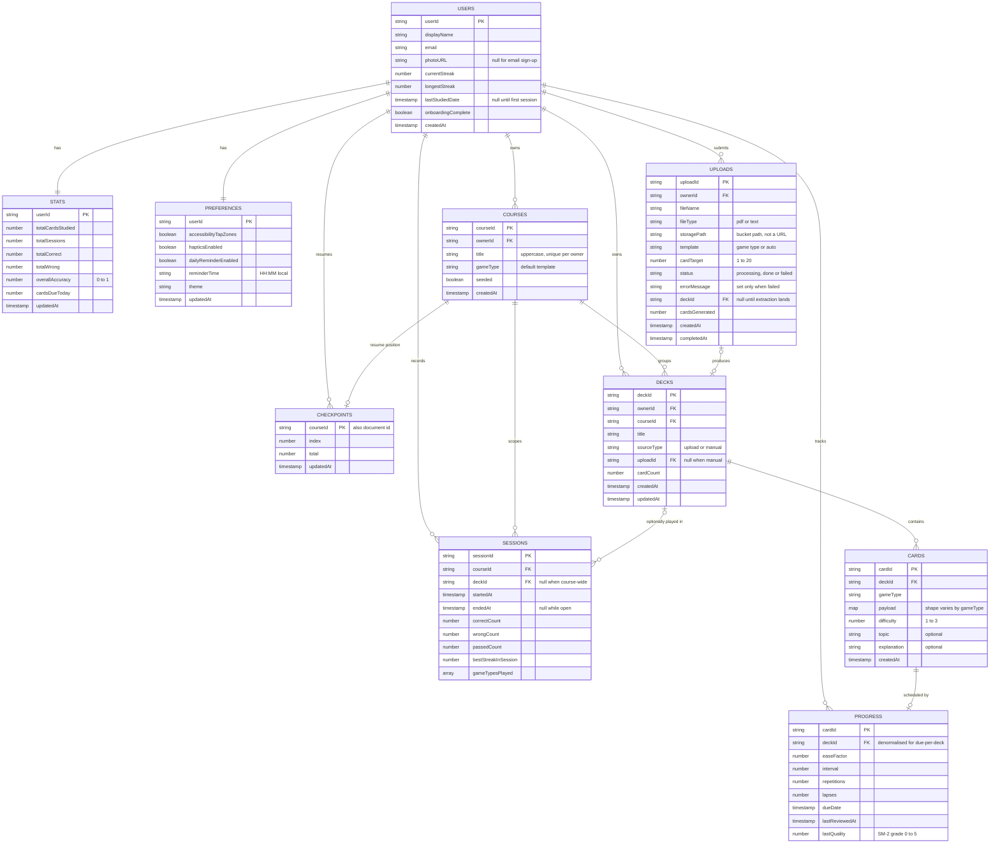

# Cardinal ERD

The Firestore data model implemented by the client, rules, and Functions. Local stores
remain the interaction-first cache; Firestore reconciliation happens in the background.
See [Implementation status](#implementation-status) for ownership and runtime detail.

Firestore is a document store, so "foreign key" here means a stored ID that the client
resolves with a second read. There are no joins, which is why several fields below are
deliberately duplicated.

## Diagram

## Collection paths

| Entity | Path | Nesting |
| --- | --- | --- |
| USERS | `users/{userId}` | root |
| STATS | `users/{userId}/stats/summary` | subcollection, fixed document id |
| PREFERENCES | `users/{userId}/preferences/settings` | subcollection, fixed document id |
| PROGRESS | `users/{userId}/progress/{cardId}` | subcollection |
| SESSIONS | `users/{userId}/sessions/{sessionId}` | subcollection |
| CHECKPOINTS | `users/{userId}/checkpoints/{courseId}` | subcollection; one resumable recap position per course |
| COURSES | `users/{userId}/courses/{courseId}` | subcollection |
| DECKS | `decks/{deckId}` | root |
| CARDS | `decks/{deckId}/cards/{cardId}` | subcollection |
| UPLOADS | `uploads/{uploadId}` | root |

Progress, sessions, checkpoints, and preferences are nested under the user because they
are private and read for one user at a time. Courses are nested for a different reason:
seeded course ids are bare slugs, so a per-user path prevents two accounts' `biology`
documents from colliding. Decks, their cards, and upload jobs are root-level, owned by
their `ownerId` fields; cards inherit ownership through their parent deck.

## Payload variants

`cards.payload` is a map whose shape is decided by `cards.gameType`. On the client this is
the discriminated union `CardContent`, so the compiler enforces the right payload for the
right template. `topic` is optional course-subject metadata; `explanation` is optional
feedback shown after an answer. The arity constraints are not decoration: the screens have
no way to render anything else, and the extraction parser drops cards that violate them.

| gameType | payload | constraint |
| --- | --- | --- |
| `compassQuiz` | `question`, `choices[]`, `correctIndex` | exactly 3 choices, index 0 to 2 |
| `trueFalseDuel` | `statement`, `isTrue` | statement under 60 characters |
| `sequenceSwipe` | `prompt`, `orderedItems[]` | exactly 4 items, stored in correct order |
| `matchRelease` | `prompt`, `pairs[]` | exactly 3 pairs of term and definition |

## Deliberate duplication

Firestore cannot join, so three fields are copies. Each is listed here so the redundancy
reads as a decision rather than an oversight.

| Field | Why it is duplicated | Cost if it drifts |
| --- | --- | --- |
| `progress.deckId` | "Everything due in this deck" is otherwise a read of every card first | Cards due in the wrong deck |
| `decks.uploadId` | The deck view shows its source filename without a second query | Provenance shown wrongly |
| `uploads.deckId` | The upload is the job record and the client polls it for where the result landed | Upload cannot find its deck |

`stats` is an aggregate of `sessions` and `progress`. It exists so the profile screen is
one read instead of a scan, and Cloud Function triggers rebuild it after either source
collection changes. The client only listens to the summary document.

## Changes from the pitch ERD

| Change | Reason |
| --- | --- |
| Added COURSES as an entity | The home screen's pills are courses, and a course owns its default template and de-duplicates by title. The pitch ERD flattened this to a `decks.category` string, which cannot carry `gameType` or `seeded` |
| `decks.category` replaced by `decks.courseId` | A reference, now that courses are real documents |
| Removed `cards.uploadId` | A third copy of the same fact. The card's deck already carries it |
| `gameType` values are `compassQuiz`, `trueFalseDuel`, `sequenceSwipe`, `matchRelease` | The pitch ERD used shorter names. These strings are persisted in saved decks and are read by the extraction prompt, the parser and all four screens, so the longer names are the ones in force |
| `users.streak` split into `currentStreak` and `longestStreak` | Carried over from the pitch ERD, which was ahead of the page 9 schema table |
| `progress.lastResult` replaced by `lastQuality`, plus `repetitions` and `lapses` | A faithful SM-2 implementation needs the 0 to 5 grade and the repetition and lapse counters, not a three-valued outcome |

## Implementation status

| Entity | State |
| --- | --- |
| USERS | Created by the email/password sign-up flow; email/password is the only implemented sign-in method. |
| COURSES | Local-first seeded and user-created records, reconciled with `users/{uid}/courses`. |
| DECKS, CARDS | Local-first records; a deck write synchronizes its root document, then its card subcollection. |
| UPLOADS | With Groq extraction enabled, the client creates the processing job and Storage object; the `processUpload` Function creates the course/deck/cards and finishes or fails the job. |
| PROGRESS | The app records SM-2 state locally on each answer, then synchronizes `users/{uid}/progress/{cardId}`. |
| SESSIONS | Local-first session tally, synchronized under the current user. |
| CHECKPOINTS | Local-first recap resume position, synchronized per user and course. |
| PREFERENCES | Local-first settings document, synchronized with a server timestamp on each write. |
| STATS | Server-derived from session and progress writes; read-only in the client. |

All local-first stores retain an AsyncStorage cache and reconcile through Firestore when a
signed-in user is available. Functions and rules are implemented in this repository; the
server workflows become active after the corresponding Firebase deployment and secrets are
configured.
